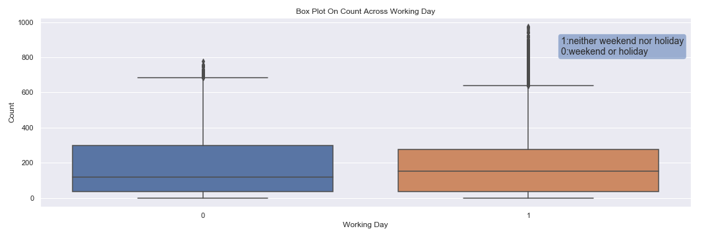

# Demystifying Machine Learning 


This notebook documents the analysis and model development for the Bike Sharing Dataset. It contains the following steps:

- About the Bike Sharing Dataset
- Descriptive Analysis
- Missing Value Analysis
- Outlier Analysis
- Correlation Analysis
- Overview metrics
- Model Selection
    - Ridge Regession
    - Support Vector Regression
    - Ensemble Regressor
    - Random Forest Regressor
- Random Forest
    - Random Forest Model
    - Feature importance
- Conclusion

## About the Bike Sharing Dataset

### Overview

Capital Bikeshare and New York Citi Bike Program, are the largest bike sharing programs in the United States. 
Since 2013, the [Citi Bike Program](https://www.citibikenyc.com/system-data) and [Capital Bikeshare](https://www.capitalbikeshare.com/system-data) has implemented a robust infrastructure for collecting data on the program's utilization. Through the team's efforts, each month bike data is collected, organized, and made public on the Citi Bike Data webpage.

Today, there exists great interest in these systems due to their important role in traffic, environmental and health issues. 

Apart from interesting real-world applications of bike sharing systems, the characteristics of data being generated by these systems make them attractive for the research. Opposed to other transport services such as bus or subway, the duration of travel, departure, and arrival position is explicitly recorded in these systems. This feature turns the bike sharing system into a virtual sensor network that can be used for sensing mobility in the city. Hence, it is expected that most of the important events in the city could be detected via monitoring these data.

### Attribute Information

Data obtained from the website was further engineered in a way that could be used for Machine Learning purposes. For this project we will focus on the Machine Learning part of it.
We have two csv files - hour and day.

Both hour.csv and day.csv have the following fields, except hr which is not available in day.csv
- instant: record index
- dteday : date
- season : season (1:spring, 2:summer, 3:fall, 4:winter)
- mnth : month ( 1 to 12)
- hr : hour (0 to 23)
- holiday : weather day is holiday or not 
- weekday : day of the week
- workingday : if day is neither weekend nor holiday is 1, otherwise is 0.
+ weathersit : 
    - 1: Clear, Few clouds, Partly cloudy, Partly cloudy
    - 2: Mist + Cloudy, Mist + Broken clouds, Mist + Few clouds, Mist
    - 3: Light Snow, Light Rain + Thunderstorm + Scattered clouds, Light Rain + Scattered clouds
    - 4: Heavy Rain + Ice Pallets + Thunderstorm + Mist, Snow + Fog
    - temp : Normalized temperature in Celsius. The values are derived via (t-t_min)/(t_max-t_min), t_min=-8, t_max=+39 (only in hourly scale)
    - atemp: Normalized feeling temperature in Celsius. The values are derived via (t-t_min)/(t_max-t_min), t_min=-16, t_max=+50 (only in hourly scale)
- hum: Normalized humidity. The values are divided to 100 (max)
- windspeed: Normalized wind speed. The values are divided to 67 (max)
- casual: count of casual users
- registered: count of registered users
- cnt: count of total rental bikes including both casual and registered

## Technology Stack
 Python, Pandas, MatplotLib, Leaflet.js, Web API,  Flask, Angular 8, Hammer.js, Angular Material


## Descriptive Analysis

In this stage, split dataset for training, validation, and testing.
Identified the category and numeric features.

```python
from sklearn.model_selection import train_test_split

train, test = train_test_split(fullData, test_size=0.2,train_size=0.8, random_state=42)

train, validate =  train_test_split(train, test_size=0.2,train_size=0.8, random_state=42)

category_features = ['season', 'holiday', 'mnth', 'hr', 'weekday', 'workingday', 'weathersit']
number_features = ['temp', 'atemp', 'hum', 'windspeed']

features= category_features + number_features
target = ['cnt']
```

## Missing Value Analysis

Check any NULL values in data:

## Outlier Analysis

### Box plots

Box plots were plotted for count of bikes rented across multiple features.





__Interpretation:__ The working day and holiday box plots indicate that more bicycles are rent during normal working days than on weekends or holidays. 
The hourly box plots show a local maximum at 8 am and one at 5 pm which indicates that most users of the bicycle rental service use the bikes to get to work or school. 
Another important factor seems to be the temperature: higher temperatures lead to an increasing number of bike rents and lower temperatures not only decrease the average number of rents but also shows more outliers in the data.

### Remove outliers from data

The distribution plot of the count values reveals that the count values do not match a normal distribution. We will use the median and interquartile range (IQR) to identify and remove outliers from the data. 

(An alternative approach would be the transformation of the target values to a normal distribution and using mean and standard deviation.)  


## Correlation Analysis


__Conclusion:__ At the end of the descriptive analysis chapter, we can note the following points:

- Casual and registered contain direct information about the bike sharing count which is to predict (data leakage). Therefore they are not considered in the feature set.
- The variables "temp" and "atemp" are strongly correlated. To reduce the dimensionality of the predictive model, the feature "atemp" is dismissed.
- The variables "hr" and "temp" seem to be promising features for the bike sharing count prediction.


## Overview Metrics

### Mean Squared Error (MSE)

MSE = $\sqrt{\frac{1}{N} \sum_{i=1}^N (x_i - y_i)^2}$

### Root Mean Squared Logarithmic Error (RMSLE)

RMSLE = $\sqrt{ \frac{1}{N} \sum_{i=1}^N (\log(x_i) - \log(y_i))^2 }$

### $R^2$ Score

$R^2=1-\frac{\sum_{i=1}^{n}e_i^2}{\sum_{i=1}^{n}(y_i-\bar{y})^2}$

## Model Selection

The characteristics of the given problem are:

- __Regression:__ The target variable is a continuous numerical variable.
- __Small dataset:__ Less than 100K samples.
- __Few features should be important:__ The correlation matrix indicates that a few features contain the information to predict the target variable.

This characteristic makes the following methods most promising: Linear Regression, Support Vector Regression, Ensemble Regressor, Random Forest Regressor.

The performance of these models in the following:

    +-----------------------+--------------------+----------+
    |         Model         | Mean Squared Error | R² score |
    +-----------------------+--------------------+----------+
    |      SGDRegressor     |      37929.42      |   0.07   |
    |         Lasso         |      35295.76      |   0.14   |
    |       ElasticNet      |      35555.92      |   0.13   |
    |         Ridge         |      35297.38      |   0.14   |
    |          SVR          |      30071.93      |   0.26   |
    |    BaggingRegressor   |      13068.24      |   0.68   |
    |         NuSVR         |      28777.35      |   0.30   |
    | RandomForestRegressor |      12686.57      |   0.69   |
    +-----------------------+--------------------+----------+
    

## Random Forest

### Random Forest Model


    +-----------------------+------------+----------+-------+----------+
    |         Model         |  Dataset   |   MSE    | RMSLE | R² score |
    +-----------------------+------------+----------+-------+----------+
    | RandomForestRegressor |  training  |  445.53  |  0.18 |   0.98   |
    | RandomForestRegressor | validation | 12713.94 |  0.47 |   0.69   |
    +-----------------------+------------+----------+-------+----------+
    


### Feature importance


__Interpretation:__ The result corresponds to the high correlation of the hour and temperature variable with the bicycle sharing count in the feature correlation matrix.


## Conclusion
__Regression:__
	Predication of bike rental count hourly or daily based on the environmental and seasonal settings.
	
__Event and Anomaly Detection__:  
		Count of rented bikes are also correlated to some events in the town which easily are traceable via search engines.
		For instance, query like "2012-10-30 washington d.c." in Google returns related results to Hurricane Sandy.Therefore the data can be used for validation of anomaly or event detection algorithms as well.

This is a work in progress, the outstanding items are :
* ETL module where:
	1. I have added geographic(latitude and longitude) information to the dataset.
	2. I have rewritten the temperature normalization in Fahrenheit instead of the current 	  	           Centigrade scale.

* Deployed and functioning application.

* Heat Maps by region using Leaflet.js.

* Use TensorFlow regression models and compare their score.

* Further use the dataset for event and anomaly detection models.

# I WILL BE BACK FOR THE JULY 2020 DEMO DAY!!


